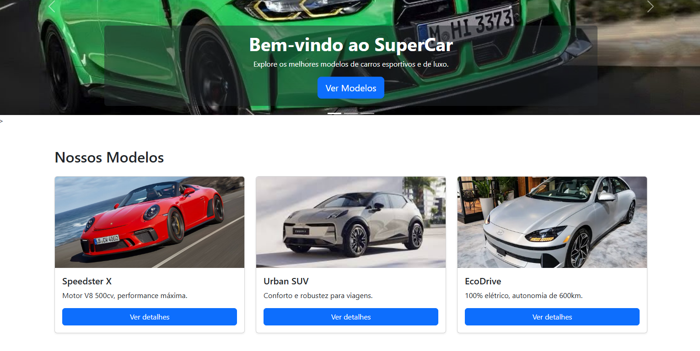
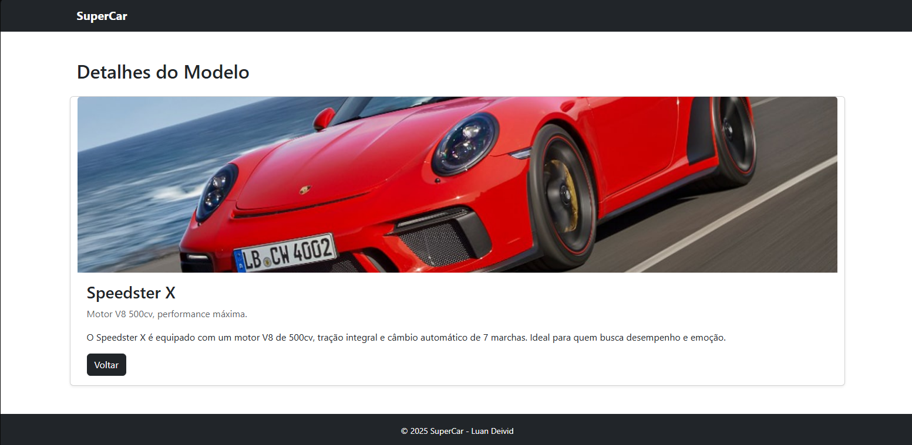

# Trabalho Prático 05 - Semanas 7 e 8

**Páginas de detalhes dinâmicas**

Nessa etapa, vamos evoluir o trabalho anterior, acrescentando a página de detalhes, conforme o  projeto escolhido. Imagine que a página principal (home-page) mostre um visão dos vários itens que existem no seu site. Ao clicar em um item, você é direcionado pra a página de detalhes. A página de detalhe vai mostrar todas as informações sobre o item do seu projeto. seja esse item uma notícia, filme, receita, lugar turístico ou evento.

Leia o enunciado completo no Canvas. 

**IMPORTANTE:** Assim como informado anteriormente, capriche na etapa pois você vai precisar dessa parte para as próximas semanas. 

**IMPORTANTE:** Você deve trabalhar e alterar apenas arquivos dentro da pasta **`public`,** mantendo os arquivos **`index.html`**, **`styles.css`** e **`app.js`** com estes nomes, conforme enunciado. Deixe todos os demais arquivos e pastas desse repositório inalterados. **PRESTE MUITA ATENÇÃO NISSO.**

## Informações Gerais

- Nome: Luan Deivid
- Matricula: 904044
- Proposta de projeto escolhida: Carros
- Breve descrição sobre seu projeto: Um site sobre carros, seus lançamentos e informações sobre eles.

## Print da Home-Page

## Print da página de detalhes do item

## Cole aqui abaixo a estrutura JSON utilizada no app.js

const carros = [
  {
    "id": 1,
    "nome": "Speedster X",
    "descricao": "Motor V8 500cv, performance máxima.",
    "detalhes": "O Speedster X é equipado com um motor V8 de 500cv, tração integral e câmbio automático de 7 marchas. Ideal para quem busca desempenho e emoção.",
    "imagem": "Porsche-1.jpg"
  },
  {
    "id": 2,
    "nome": "Urban SUV",
    "descricao": "Conforto e robustez para viagens.",
    "detalhes": "O Urban SUV combina tecnologia e segurança, com espaço interno amplo, motor turbo eficiente e sistema de entretenimento de última geração.",
    "imagem": "urban.jpg"
  },
  {
    "id": 3,
    "nome": "EcoDrive",
    "descricao": "100% elétrico, autonomia de 600km.",
    "detalhes": "O EcoDrive é o futuro da mobilidade. Sustentável, com recarga rápida e autonomia de até 600 km, além de tecnologia de direção semiautônoma.",
    "imagem": "eco.jpg"
  }
];